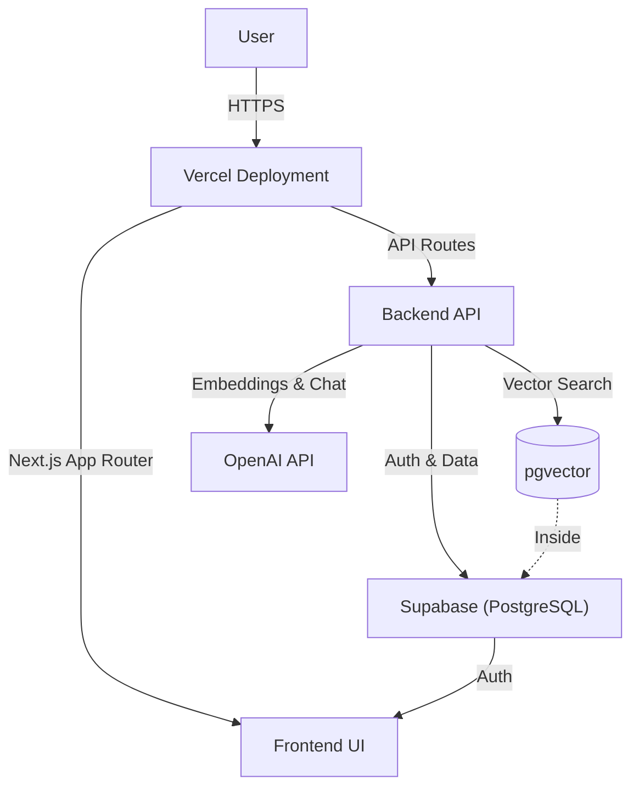

# KU Connect - Research Hub Dashboard

KU Connect is a comprehensive research dashboard for Guro Hospital, designed to facilitate researcher matching, performance tracking, and AI-powered research topic exploration.

## 🏗 System Architecture

The project is built using a modern serverless architecture, leveraging **Next.js** for the full-stack framework and **Supabase** for the backend database and authentication.

### Technology Stack

- **Frontend**: 
  - [Next.js 14](https://nextjs.org/) (App Router)
  - [Tailwind CSS](https://tailwindcss.com/) (Styling)
  - [Shadcn UI](https://ui.shadcn.com/) (Component Library)
  - [Recharts](https://recharts.org/) (Data Visualization)
- **Backend**: 
  - Next.js API Routes (Serverless Functions)
  - [Supabase](https://supabase.com/) (PostgreSQL Database, Auth, Vector Store)
- **AI & Search**:
  - [OpenAI API](https://openai.com/) (`text-embedding-3-small` for embeddings, `gpt-4o` for summaries)
  - [pgvector](https://github.com/pgvector/pgvector) (Vector Similarity Search)
- **Deployment**:
  - [Vercel](https://vercel.com/) (Hosting & CI/CD)

### Architecture Diagram



## 📂 Page Layout & Features

The application is organized into a dashboard layout with the following key pages:

### 1. **Dashboard (`/`)**
- **Overview**: Provides a high-level summary of research statistics.
- **Key Metrics**: Total researchers, total budget, active projects.
- **Visualizations**: Charts showing research trends and platform participation.

### 2. **AI Search (`/search`)**
- **Semantic Search**: Allows users to search for researchers and projects using natural language queries (e.g., "AI in radiology").
- **RAG (Retrieval-Augmented Generation)**: 
  1. Converts query to vector embedding.
  2. Searches Supabase for similar researchers/projects.
  3. Uses GPT-4o to summarize the findings.
- **Detail View**: Clickable cards to view detailed researcher profiles (publications, budget, etc.).

### 3. **Researcher Matching (`/matching`)**
- **Purpose**: Finds potential collaborators based on specific criteria.
- **Features**: Filter by department, research interests, and expertise.

### 4. **Performance (`/performance`)**
- **Metrics**: Detailed breakdown of research performance.
- **Charts**: Publication counts, citation impact, and funding distribution.

### 5. **Demographics (`/demographics`)**
- **Analysis**: Statistical breakdown of the researcher pool.
- **Data**: Distribution by position, department, and years of experience.

### 6. **Platforms (`/platforms`)**
- **Focus**: Information on specific research platforms (e.g., Data Science, Precision Medicine).

### 7. **Companies (`/companies`)**
- **Partnerships**: List of internal and external partner companies.

## 🚀 Getting Started

### Prerequisites
- Node.js 18+
- Supabase Project
- OpenAI API Key

### Environment Variables
Create a `.env.local` file in the root directory:

```env
NEXT_PUBLIC_SUPABASE_URL=your_supabase_url
NEXT_PUBLIC_SUPABASE_ANON_KEY=your_supabase_anon_key
OPENAI_API_KEY=your_openai_api_key
```

### Installation

```bash
npm install
```

### Running Locally

```bash
npm run dev
```

Open [http://localhost:3000](http://localhost:3000) with your browser to see the result.

## 🛠 Database Schema (Supabase)

The project uses the following key tables:

- **`researchers`**: Stores researcher profiles, stats, and vector embeddings.
  - New columns: `recent_papers_3yr`, `total_pi_count`, `platforms`, `ku_url`, `paper_topics`
- **`projects`**: Stores research projects, budgets, and vector embeddings.

**Vector Search Functions**:
- `match_researchers`: Finds researchers by embedding similarity (supports department filter).
- `match_projects`: Finds projects by embedding similarity.

## 🛠 Utility Scripts

The project includes several Python scripts for data management:

- **`migrate_data.py`**: Main script to populate the database from Excel (`total_df.xlsx`). Handles embeddings generation.
- **`update_local_images.py`**: Updates researcher profile images in the database by matching filenames in `public/images/researchers/`.
- **`scrape_images_playwright.py`**: Scrapes researcher images from the hospital website using Playwright.
- **`update_paper_topics.py`**: Updates the `paper_topics` column by parsing the Excel data (handles homonyms).
- **`generate_mocks.py`**: Generates mock data for development.

## 📜 License

This project is private and proprietary to Guro Hospital.
